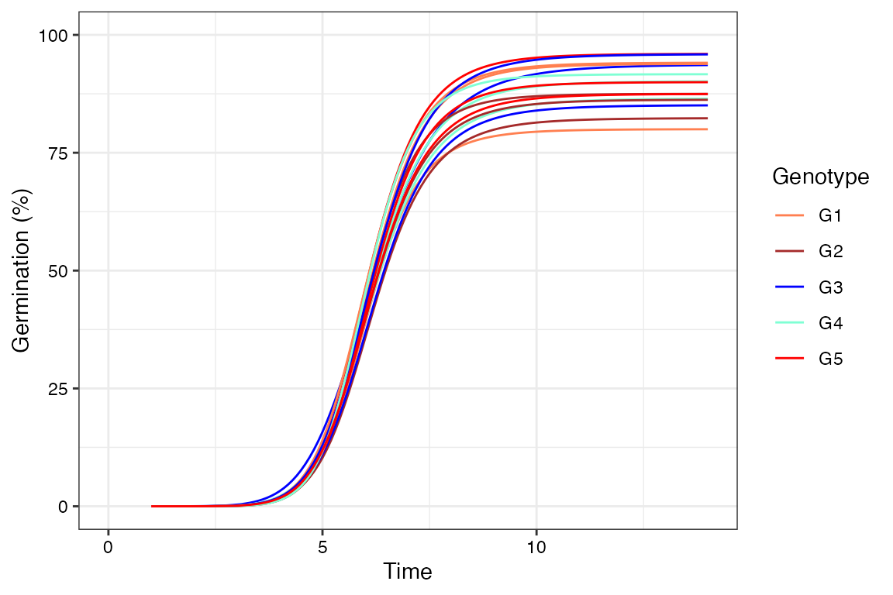

# The \`germinationmetrics\` Package: A Brief Introduction

ICAR-National Bureau of Plant Genetic Resources, New Delhi.


## Overview

The package `germinationmetrics` is a collection of functions which
implements various methods for describing the time-course of germination
in terms of single-value germination indices as well as fitted curves.

The goal of this vignette is to introduce the users to these functions
and get started in describing sequentially recorded germination count
data. This document assumes a basic knowledge of `R` programming
language.

## Installation

The package can be installed using the following functions:

``` r
# Install from CRAN
install.packages('germinationmetrics', dependencies=TRUE)

# Install development version from Github
devtools::install_github("aravind-j/germinationmetrics")
```

Then the package can be loaded using the function

``` r
library(germinationmetrics)
```

    --------------------------------------------------------------------------------
    Welcome to germinationmetrics version 0.1.9


    # To know how to use this package type:
      browseVignettes(package = 'germinationmetrics')
      for the package vignette.

    # To know whats new in this version type:
      news(package='germinationmetrics')
      for the NEWS file.

    # To cite the methods in the package type:
      citation(package='germinationmetrics')

    # To suppress this message use:
      suppressPackageStartupMessages(library(germinationmetrics))
    --------------------------------------------------------------------------------

## Version History

The current version of the package is 0.1.9. The previous versions are
as follows.

**Table 1.** Version history of `germinationmetrics` `R` package.

| Version | Date       |
|:--------|:-----------|
| 0.1.0   | 2018-04-17 |
| 0.1.1   | 2018-07-26 |
| 0.1.1.1 | 2018-10-16 |
| 0.1.2   | 2018-10-31 |
| 0.1.3   | 2019-01-19 |
| 0.1.4   | 2020-06-16 |
| 0.1.5   | 2021-02-17 |
| 0.1.6   | 2022-06-15 |
| 0.1.7   | 2022-08-28 |

To know detailed history of changes use
`news(package='germinationmetrics')`.

## Germination count data

Typically in a germination test, the germination count data of a fixed
number of seeds is recorded at regular intervals for a definite period
of time or until all the seeds have germinated. These germination count
data can be either partial or cumulative (Table 2).

**Table 2 :** A typical germination count data.

| intervals | counts | cumulative.counts |
|----------:|-------:|------------------:|
|         1 |      0 |                 0 |
|         2 |      0 |                 0 |
|         3 |      0 |                 0 |
|         4 |      0 |                 0 |
|         5 |      4 |                 4 |
|         6 |     17 |                21 |
|         7 |     10 |                31 |
|         8 |      7 |                38 |
|         9 |      1 |                39 |
|        10 |      0 |                39 |
|        11 |      1 |                40 |
|        12 |      0 |                40 |
|        13 |      0 |                40 |
|        14 |      0 |                40 |

The time-course of germination can be plotted as follows.

``` r
data <- data.frame(intervals = 1:14,
                   counts = c(0, 0, 0, 0, 4, 17, 10, 7, 1, 0, 1, 0, 0, 0))

# Partial germination counts
x <- data$counts
# Cumulative germination counts
y <- cumsum(x)
# Time intervals of observations
int <- data$intervals

plot(int, cumsum(x))
```


## Single-value germination indices

The details about the single-value germination indices implemented in
`germinationmetrics` are described in Table 3.

**Table 3 :** Single-value germination indices implemented in
`germinationmetrics`.

[TABLE]

#### Examples

#### `GermPercent()`

``` r
x <- c(0, 0, 0, 0, 4, 17, 10, 7, 1, 0, 1, 0, 0, 0)
y <- c(0, 0, 0, 0, 4, 21, 31, 38, 39, 39, 40, 40, 40, 40)
z <- c(0, 0, 0, 0, 11, 11, 9, 7, 1, 0, 1, 0, 0, 0)
int <- 1:length(x)

# From partial germination counts
#----------------------------------------------------------------------------
GermPercent(germ.counts = x, total.seeds = 50)
```

    [1] 80

``` r
PeakGermPercent(germ.counts = x, intervals = int, total.seeds = 50)
```

    [1] 34

``` r
# For multiple peak germination times
PeakGermPercent(germ.counts = z, intervals = int, total.seeds = 50)
```

    Warning in PeakGermPercent(germ.counts = z, intervals = int, total.seeds = 50):
    Multiple peak germination times exist.

    [1] 22

``` r
# From cumulative germination counts
#----------------------------------------------------------------------------
GermPercent(germ.counts = y, total.seeds = 50, partial = FALSE)
```

    [1] 80

``` r
PeakGermPercent(germ.counts = y, intervals = int, total.seeds = 50,
                partial = FALSE)
```

    [1] 34

``` r
# For multiple peak germination times
PeakGermPercent(germ.counts = cumsum(z), intervals = int, total.seeds = 50,
                partial = FALSE)
```

    Warning in PeakGermPercent(germ.counts = cumsum(z), intervals = int,
    total.seeds = 50, : Multiple peak germination times exist.

    [1] 22

``` r
# From number of germinated seeds
#----------------------------------------------------------------------------
GermPercent(germinated.seeds = 40, total.seeds = 50)
```

    [1] 80

#### `FirstGermTime(), LastGermTime(), PeakGermTime(), TimeSpreadGerm()`

``` r
x <- c(0, 0, 0, 0, 4, 17, 10, 7, 1, 0, 1, 0, 0, 0)
y <- c(0, 0, 0, 0, 4, 21, 31, 38, 39, 39, 40, 40, 40, 40)
z <- c(0, 0, 0, 0, 11, 11, 9, 7, 1, 0, 1, 0, 0, 0)
int <- 1:length(x)

# From partial germination counts
#----------------------------------------------------------------------------
FirstGermTime(germ.counts = x, intervals = int)
```

    [1] 5

``` r
LastGermTime(germ.counts = x, intervals = int)
```

    [1] 11

``` r
TimeSpreadGerm(germ.counts = x, intervals = int)
```

    [1] 6

``` r
PeakGermTime(germ.counts = x, intervals = int)
```

    [1] 6

``` r
# For multiple peak germination times
PeakGermTime(germ.counts = z, intervals = int)
```

    Warning in PeakGermTime(germ.counts = z, intervals = int): Multiple peak
    germination times exist.

    [1] 5 6

``` r
# From cumulative germination counts
#----------------------------------------------------------------------------
FirstGermTime(germ.counts = y, intervals = int, partial = FALSE)
```

    [1] 5

``` r
LastGermTime(germ.counts = y, intervals = int, partial = FALSE)
```

    [1] 11

``` r
TimeSpreadGerm(germ.counts = y, intervals = int, partial = FALSE)
```

    [1] 6

``` r
PeakGermTime(germ.counts = y, intervals = int, partial = FALSE)
```

    [1] 6

``` r
# For multiple peak germination time
PeakGermTime(germ.counts = cumsum(z), intervals = int, partial = FALSE)
```

    Warning in PeakGermTime(germ.counts = cumsum(z), intervals = int, partial =
    FALSE): Multiple peak germination times exist.

    [1] 5 6

#### `t50()`

``` r
x <- c(0, 0, 0, 0, 4, 17, 10, 7, 1, 0, 1, 0, 0, 0)
y <- c(0, 0, 0, 0, 4, 21, 31, 38, 39, 39, 40, 40, 40, 40)
int <- 1:length(x)

# From partial germination counts
#----------------------------------------------------------------------------
t50(germ.counts = x, intervals = int, method = "coolbear")
```

    [1] 5.970588

``` r
t50(germ.counts = x, intervals = int, method = "farooq")
```

    [1] 5.941176

``` r
# From cumulative germination counts
#----------------------------------------------------------------------------
t50(germ.counts = y, intervals = int, partial = FALSE, method = "coolbear")
```

    [1] 5.970588

``` r
t50(germ.counts = y, intervals = int, partial = FALSE, method = "farooq")
```

    [1] 5.941176

#### `MeanGermTime(), VarGermTime(), SEGermTime(), CVGermTime()`

``` r
x <- c(0, 0, 0, 0, 4, 17, 10, 7, 1, 0, 1, 0, 0, 0)
y <- c(0, 0, 0, 0, 4, 21, 31, 38, 39, 39, 40, 40, 40, 40)
int <- 1:length(x)

# From partial germination counts
#----------------------------------------------------------------------------
MeanGermTime(germ.counts = x, intervals = int)
```

    [1] 6.7

``` r
VarGermTime(germ.counts = x, intervals = int)
```

    [1] 1.446154

``` r
SEGermTime(germ.counts = x, intervals = int)
```

    [1] 0.1901416

``` r
CVGermTime(germ.counts = x, intervals = int)
```

    [1] 0.1794868

``` r
# From cumulative germination counts
#----------------------------------------------------------------------------
MeanGermTime(germ.counts = y, intervals = int, partial = FALSE)
```

    [1] 6.7

``` r
VarGermTime(germ.counts = y, intervals = int, partial = FALSE)
```

    [1] 1.446154

``` r
SEGermTime(germ.counts = y, intervals = int, partial = FALSE)
```

    [1] 0.1901416

``` r
CVGermTime(germ.counts = y, intervals = int, partial = FALSE)
```

    [1] 0.1794868

#### `MeanGermRate(), CVG(), VarGermRate(), SEGermRate(), GermRateRecip()`

``` r
x <- c(0, 0, 0, 0, 4, 17, 10, 7, 1, 0, 1, 0, 0, 0)
y <- c(0, 0, 0, 0, 4, 21, 31, 38, 39, 39, 40, 40, 40, 40)
int <- 1:length(x)

# From partial germination counts
#----------------------------------------------------------------------------
MeanGermRate(germ.counts = x, intervals = int)
```

    [1] 0.1492537

``` r
CVG(germ.counts = x, intervals = int)
```

    [1] 14.92537

``` r
VarGermRate(germ.counts = x, intervals = int)
```

    [1] 0.0007176543

``` r
SEGermRate(germ.counts = x, intervals = int)
```

    [1] 0.004235724

``` r
GermRateRecip(germ.counts = x, intervals = int, method = "coolbear")
```

    [1] 0.1674877

``` r
GermRateRecip(germ.counts = x, intervals = int, method = "farooq")
```

    [1] 0.1683168

``` r
# From cumulative germination counts
#----------------------------------------------------------------------------
MeanGermRate(germ.counts = y, intervals = int, partial = FALSE)
```

    [1] 0.1492537

``` r
CVG(germ.counts = y, intervals = int, partial = FALSE)
```

    [1] 14.92537

``` r
VarGermRate(germ.counts = y, intervals = int, partial = FALSE)
```

    [1] 0.0007176543

``` r
SEGermRate(germ.counts = y, intervals = int, partial = FALSE)
```

    [1] 0.004235724

``` r
GermRateRecip(germ.counts = y, intervals = int,
              method = "coolbear", partial = FALSE)
```

    [1] 0.1674877

``` r
GermRateRecip(germ.counts = y, intervals = int,
              method = "farooq", partial = FALSE)
```

    [1] 0.1683168

#### `GermSpeed(), GermSpeedAccumulated(), GermSpeedCorrected()`

``` r
x <- c(0, 0, 0, 0, 4, 17, 10, 7, 1, 0, 1, 0, 0, 0)
y <- c(0, 0, 0, 0, 4, 21, 31, 38, 39, 39, 40, 40, 40, 40)
int <- 1:length(x)

# From partial germination counts
#----------------------------------------------------------------------------
GermSpeed(germ.counts = x, intervals = int)
```

    [1] 6.138925

``` r
GermSpeedAccumulated(germ.counts = x, intervals = int)
```

    [1] 34.61567

``` r
GermSpeedCorrected(germ.counts = x, intervals = int, total.seeds = 50,
                   method = "normal")
```

    [1] 0.1534731

``` r
GermSpeedCorrected(germ.counts = x, intervals = int, total.seeds = 50,
                   method = "accumulated")
```

    [1] 0.8653917

``` r
# From partial germination counts (with percentages instead of counts)
#----------------------------------------------------------------------------
GermSpeed(germ.counts = x, intervals = int,
          percent = TRUE, total.seeds = 50)
```

    [1] 12.27785

``` r
GermSpeedAccumulated(germ.counts = x, intervals = int,
                     percent = TRUE, total.seeds = 50)
```

    [1] 69.23134

``` r
# From cumulative germination counts
#----------------------------------------------------------------------------
GermSpeed(germ.counts = y, intervals = int, partial = FALSE)
```

    [1] 6.138925

``` r
GermSpeedAccumulated(germ.counts = y, intervals = int, partial = FALSE)
```

    [1] 34.61567

``` r
GermSpeedCorrected(germ.counts = y, intervals = int,
                   partial = FALSE, total.seeds = 50, method = "normal")
```

    [1] 0.1534731

``` r
GermSpeedCorrected(germ.counts = y, intervals = int,
                   partial = FALSE, total.seeds = 50, method = "accumulated")
```

    [1] 0.8653917

``` r
# From cumulative germination counts (with percentages instead of counts)
#----------------------------------------------------------------------------
GermSpeed(germ.counts = y, intervals = int, partial = FALSE,
          percent = TRUE, total.seeds = 50)
```

    [1] 12.27785

``` r
GermSpeedAccumulated(germ.counts = y, intervals = int, partial = FALSE,
                     percent = TRUE, total.seeds = 50)
```

    [1] 69.23134

#### `WeightGermPercent()`

``` r
x <- c(0, 0, 0, 0, 4, 17, 10, 7, 1, 0, 1, 0, 0, 0)
y <- c(0, 0, 0, 0, 4, 21, 31, 38, 39, 39, 40, 40, 40, 40)
int <- 1:length(x)

# From partial germination counts
#----------------------------------------------------------------------------
WeightGermPercent(germ.counts = x, total.seeds = 50, intervals = int)
```

    [1] 47.42857

``` r
# From cumulative germination counts
#----------------------------------------------------------------------------
WeightGermPercent(germ.counts = y, total.seeds = 50, intervals = int,
                  partial = FALSE)
```

    [1] 47.42857

#### `MeanGermPercent(), MeanGermNumber()`

``` r
x <- c(0, 0, 0, 0, 4, 17, 10, 7, 1, 0, 1, 0, 0, 0)
y <- c(0, 0, 0, 0, 4, 21, 31, 38, 39, 39, 40, 40, 40, 40)
int <- 1:length(x)

# From partial germination counts
#----------------------------------------------------------------------------
MeanGermPercent(germ.counts = x, total.seeds = 50, intervals = int)
```

    [1] 5.714286

``` r
MeanGermNumber(germ.counts = x, intervals = int)
```

    [1] 2.857143

``` r
# From cumulative germination counts
#----------------------------------------------------------------------------
MeanGermPercent(germ.counts = y, total.seeds = 50, intervals = int, partial = FALSE)
```

    [1] 5.714286

``` r
MeanGermNumber(germ.counts = y, intervals = int, partial = FALSE)
```

    [1] 2.857143

``` r
# From number of germinated seeds
#----------------------------------------------------------------------------
MeanGermPercent(germinated.seeds = 40, total.seeds = 50, intervals = int)
```

    [1] 5.714286

#### `TimsonsIndex(), GermRateGeorge()`

``` r
x <- c(0, 0, 0, 0, 4, 17, 10, 7, 1, 0, 1, 0, 0, 0)
y <- c(0, 0, 0, 0, 4, 21, 31, 38, 39, 39, 40, 40, 40, 40)
int <- 1:length(x)

# From partial germination counts
#----------------------------------------------------------------------------
# Without max specified
TimsonsIndex(germ.counts = x, intervals = int, total.seeds = 50)
```

    [1] 664

``` r
TimsonsIndex(germ.counts = x, intervals = int, total.seeds = 50,
             modification = "none")
```

    [1] 664

``` r
TimsonsIndex(germ.counts = x, intervals = int, total.seeds = 50,
             modification = "labouriau")
```

    [1] 8.3

``` r
TimsonsIndex(germ.counts = x, intervals = int, total.seeds = 50,
             modification = "khanungar")
```

    [1] 47.42857

``` r
GermRateGeorge(germ.counts = x, intervals = int)
```

    [1] 332

``` r
# With max specified
TimsonsIndex(germ.counts = x, intervals = int, total.seeds = 50, max = 10)
```

    [1] 344

``` r
TimsonsIndex(germ.counts = x, intervals = int, total.seeds = 50,
             max = 10, modification = "none")
```

    [1] 344

``` r
TimsonsIndex(germ.counts = x, intervals = int, total.seeds = 50,
             max = 10, modification = "labouriau")
```

    [1] 4.410256

``` r
TimsonsIndex(germ.counts = x, intervals = int, total.seeds = 50,
             max = 10, modification = "khanungar")
```

    [1] 24.57143

``` r
GermRateGeorge(germ.counts = x, intervals = int, max = 10)
```

    [1] 172

``` r
GermRateGeorge(germ.counts = x, intervals = int, max = 14)
```

    [1] 332

``` r
# From cumulative germination counts
#----------------------------------------------------------------------------
# Without max specified
TimsonsIndex(germ.counts = y, intervals = int, partial = FALSE,
             total.seeds = 50)
```

    [1] 664

``` r
TimsonsIndex(germ.counts = y, intervals = int, partial = FALSE,
             total.seeds = 50,
             modification = "none")
```

    [1] 664

``` r
TimsonsIndex(germ.counts = y, intervals = int, partial = FALSE,
             total.seeds = 50,
             modification = "labouriau")
```

    [1] 8.3

``` r
TimsonsIndex(germ.counts = y, intervals = int, partial = FALSE,
             total.seeds = 50,
             modification = "khanungar")
```

    [1] 47.42857

``` r
GermRateGeorge(germ.counts = y, intervals = int, partial = FALSE)
```

    [1] 332

``` r
# With max specified
TimsonsIndex(germ.counts = y, intervals = int, partial = FALSE,
             total.seeds = 50, max = 10)
```

    [1] 344

``` r
TimsonsIndex(germ.counts = y, intervals = int, partial = FALSE,
             total.seeds = 50,
             max = 10, modification = "none")
```

    [1] 344

``` r
TimsonsIndex(germ.counts = y, intervals = int, partial = FALSE,
             total.seeds = 50,
             max = 10, modification = "labouriau")
```

    [1] 4.410256

``` r
TimsonsIndex(germ.counts = y, intervals = int, partial = FALSE,
             total.seeds = 50,
             max = 10, modification = "khanungar")
```

    [1] 24.57143

``` r
GermRateGeorge(germ.counts = y, intervals = int, partial = FALSE,
               max = 10)
```

    [1] 172

``` r
GermRateGeorge(germ.counts = y, intervals = int, partial = FALSE,
               max = 14)
```

    [1] 332

#### `GermIndex()`

``` r
x <- c(0, 0, 0, 0, 4, 17, 10, 7, 1, 0, 1, 0, 0, 0)
y <- c(0, 0, 0, 0, 4, 21, 31, 38, 39, 39, 40, 40, 40, 40)
int <- 1:length(x)

# From partial germination counts
#----------------------------------------------------------------------------
GermIndex(germ.counts = x, intervals = int, total.seeds = 50)
```

    [1] 5.84

``` r
GermIndex(germ.counts = x, intervals = int, total.seeds = 50,
          modification = "none")
```

    [1] 5.84

``` r
GermIndex(germ.counts = x, intervals = int, total.seeds = 50,
          modification = "santanaranal")
```

    [1] 7.3

``` r
# From cumulative germination counts
#----------------------------------------------------------------------------
GermIndex(germ.counts = y, intervals = int, partial = FALSE,
          total.seeds = 50)
```

    [1] 5.84

``` r
GermIndex(germ.counts = y, intervals = int, partial = FALSE,
          total.seeds = 50,
          modification = "none")
```

    [1] 5.84

``` r
GermIndex(germ.counts = y, intervals = int, partial = FALSE,
          total.seeds = 50,
          modification = "santanaranal")
```

    [1] 7.3

#### `EmergenceRateIndex()`

``` r
x <- c(0, 0, 0, 0, 4, 17, 10, 7, 1, 0, 1, 0, 0, 0)
y <- c(0, 0, 0, 0, 4, 21, 31, 38, 39, 39, 40, 40, 40, 40)
int <- 1:length(x)

# From partial germination counts
#----------------------------------------------------------------------------
EmergenceRateIndex(germ.counts = x, intervals = int, total.seeds = 50)
```

    [1] 292

``` r
EmergenceRateIndex(germ.counts = x, intervals = int, total.seeds = 50,
                   method = "shmueligoldberg")
```

    [1] 292

``` r
EmergenceRateIndex(germ.counts = x, intervals = int, total.seeds = 50,
                   method = "sgsantanaranal")
```

    [1] 7.3

``` r
EmergenceRateIndex(germ.counts = x, intervals = int, total.seeds = 50,
                   method = "bilbrowanjura")
```

    [1] 5.970149

``` r
EmergenceRateIndex(germ.counts = x, intervals = int, total.seeds = 50,
                   method = "fakorede")
```

    [1] 8.375

``` r
# From cumulative germination counts
#----------------------------------------------------------------------------
EmergenceRateIndex(germ.counts = y, intervals = int, total.seeds = 50,
                   partial = FALSE)
```

    [1] 292

``` r
EmergenceRateIndex(germ.counts = y, intervals = int, total.seeds = 50,
                   partial = FALSE,
                   method = "shmueligoldberg")
```

    [1] 292

``` r
EmergenceRateIndex(germ.counts = y, intervals = int, total.seeds = 50,
                   partial = FALSE,
                   method = "sgsantanaranal")
```

    [1] 7.3

``` r
EmergenceRateIndex(germ.counts = y, intervals = int, total.seeds = 50,
                   partial = FALSE,
                   method = "bilbrowanjura")
```

    [1] 5.970149

``` r
EmergenceRateIndex(germ.counts = y, intervals = int, total.seeds = 50,
                   partial = FALSE,
                   method = "fakorede")
```

    [1] 8.375

#### `PeakValue(), GermValue()`

``` r
x <- c(0, 0, 34, 40, 21, 10, 4, 5, 3, 5, 8, 7, 7, 6, 6, 4, 0, 2, 0, 2)
y <- c(0, 0, 34, 74, 95, 105, 109, 114, 117, 122, 130, 137, 144, 150,
      156, 160, 160, 162, 162, 164)
int <- 1:length(x)
total.seeds = 200

# From partial germination counts
#----------------------------------------------------------------------------
PeakValue(germ.counts = x, intervals = int, total.seeds = 200)
```

    [1] 9.5

``` r
GermValue(germ.counts = x, intervals = int, total.seeds = 200,
          method = "czabator")
```

    $`Germination Value`
    [1] 38.95

    [[2]]
       germ.counts intervals Cumulative.germ.counts Cumulative.germ.percent
    3           34         3                     34                    17.0
    4           40         4                     74                    37.0
    5           21         5                     95                    47.5
    6           10         6                    105                    52.5
    7            4         7                    109                    54.5
    8            5         8                    114                    57.0
    9            3         9                    117                    58.5
    10           5        10                    122                    61.0
    11           8        11                    130                    65.0
    12           7        12                    137                    68.5
    13           7        13                    144                    72.0
    14           6        14                    150                    75.0
    15           6        15                    156                    78.0
    16           4        16                    160                    80.0
    17           0        17                    160                    80.0
    18           2        18                    162                    81.0
    19           0        19                    162                    81.0
    20           2        20                    164                    82.0
            DGS
    3  5.666667
    4  9.250000
    5  9.500000
    6  8.750000
    7  7.785714
    8  7.125000
    9  6.500000
    10 6.100000
    11 5.909091
    12 5.708333
    13 5.538462
    14 5.357143
    15 5.200000
    16 5.000000
    17 4.705882
    18 4.500000
    19 4.263158
    20 4.100000

``` r
GermValue(germ.counts = x, intervals = int, total.seeds = 200,
          method = "dp", k = 10)
```

    $`Germination Value`
    [1] 53.36595

    [[2]]
       germ.counts intervals Cumulative.germ.counts Cumulative.germ.percent
    3           34         3                     34                    17.0
    4           40         4                     74                    37.0
    5           21         5                     95                    47.5
    6           10         6                    105                    52.5
    7            4         7                    109                    54.5
    8            5         8                    114                    57.0
    9            3         9                    117                    58.5
    10           5        10                    122                    61.0
    11           8        11                    130                    65.0
    12           7        12                    137                    68.5
    13           7        13                    144                    72.0
    14           6        14                    150                    75.0
    15           6        15                    156                    78.0
    16           4        16                    160                    80.0
    17           0        17                    160                    80.0
    18           2        18                    162                    81.0
    19           0        19                    162                    81.0
    20           2        20                    164                    82.0
            DGS SumDGSbyN        GV
    3  5.666667  5.666667  9.633333
    4  9.250000  7.458333 27.595833
    5  9.500000  8.138889 38.659722
    6  8.750000  8.291667 43.531250
    7  7.785714  8.190476 44.638095
    8  7.125000  8.012897 45.673512
    9  6.500000  7.796769 45.611097
    10 6.100000  7.584673 46.266503
    11 5.909091  7.398497 48.090230
    12 5.708333  7.229481 49.521942
    13 5.538462  7.075752 50.945411
    14 5.357143  6.932534 51.994006
    15 5.200000  6.799262 53.034246
    16 5.000000  6.670744 53.365948
    17 4.705882  6.539753 52.318022
    18 4.500000  6.412268 51.939373
    19 4.263158  6.285850 50.915385
    20 4.100000  6.164414 50.548194

    $testend
    [1] 16

``` r
GermValue(germ.counts = x, intervals = int, total.seeds = 200,
          method = "czabator", from.onset = FALSE)
```

    $`Germination Value`
    [1] 38.95

    [[2]]
       germ.counts intervals Cumulative.germ.counts Cumulative.germ.percent
    1            0         1                      0                     0.0
    2            0         2                      0                     0.0
    3           34         3                     34                    17.0
    4           40         4                     74                    37.0
    5           21         5                     95                    47.5
    6           10         6                    105                    52.5
    7            4         7                    109                    54.5
    8            5         8                    114                    57.0
    9            3         9                    117                    58.5
    10           5        10                    122                    61.0
    11           8        11                    130                    65.0
    12           7        12                    137                    68.5
    13           7        13                    144                    72.0
    14           6        14                    150                    75.0
    15           6        15                    156                    78.0
    16           4        16                    160                    80.0
    17           0        17                    160                    80.0
    18           2        18                    162                    81.0
    19           0        19                    162                    81.0
    20           2        20                    164                    82.0
            DGS
    1  0.000000
    2  0.000000
    3  5.666667
    4  9.250000
    5  9.500000
    6  8.750000
    7  7.785714
    8  7.125000
    9  6.500000
    10 6.100000
    11 5.909091
    12 5.708333
    13 5.538462
    14 5.357143
    15 5.200000
    16 5.000000
    17 4.705882
    18 4.500000
    19 4.263158
    20 4.100000

``` r
GermValue(germ.counts = x, intervals = int, total.seeds = 200,
          method = "dp", k = 10, from.onset = FALSE)
```

    $`Germination Value`
    [1] 46.6952

    [[2]]
       germ.counts intervals Cumulative.germ.counts Cumulative.germ.percent
    1            0         1                      0                     0.0
    2            0         2                      0                     0.0
    3           34         3                     34                    17.0
    4           40         4                     74                    37.0
    5           21         5                     95                    47.5
    6           10         6                    105                    52.5
    7            4         7                    109                    54.5
    8            5         8                    114                    57.0
    9            3         9                    117                    58.5
    10           5        10                    122                    61.0
    11           8        11                    130                    65.0
    12           7        12                    137                    68.5
    13           7        13                    144                    72.0
    14           6        14                    150                    75.0
    15           6        15                    156                    78.0
    16           4        16                    160                    80.0
    17           0        17                    160                    80.0
    18           2        18                    162                    81.0
    19           0        19                    162                    81.0
    20           2        20                    164                    82.0
            DGS SumDGSbyN        GV
    1  0.000000  0.000000  0.000000
    2  0.000000  0.000000  0.000000
    3  5.666667  1.888889  3.211111
    4  9.250000  3.729167 13.797917
    5  9.500000  4.883333 23.195833
    6  8.750000  5.527778 29.020833
    7  7.785714  5.850340 31.884354
    8  7.125000  6.009673 34.255134
    9  6.500000  6.064153 35.475298
    10 6.100000  6.067738 37.013202
    11 5.909091  6.053316 39.346552
    12 5.708333  6.024567 41.268285
    13 5.538462  5.987174 43.107655
    14 5.357143  5.942172 44.566291
    15 5.200000  5.892694 45.963013
    16 5.000000  5.836901 46.695205
    17 4.705882  5.770370 46.162961
    18 4.500000  5.699794 46.168331
    19 4.263158  5.624182 45.555871
    20 4.100000  5.547972 45.493374

    $testend
    [1] 16

``` r
# From cumulative germination counts
#----------------------------------------------------------------------------
PeakValue(germ.counts = y, interval = int, total.seeds = 200,
          partial = FALSE)
```

    [1] 9.5

``` r
GermValue(germ.counts = y, intervals = int, total.seeds = 200,
          partial = FALSE, method = "czabator")
```

    $`Germination Value`
    [1] 38.95

    [[2]]
       germ.counts intervals Cumulative.germ.counts Cumulative.germ.percent
    3           34         3                     34                    17.0
    4           40         4                     74                    37.0
    5           21         5                     95                    47.5
    6           10         6                    105                    52.5
    7            4         7                    109                    54.5
    8            5         8                    114                    57.0
    9            3         9                    117                    58.5
    10           5        10                    122                    61.0
    11           8        11                    130                    65.0
    12           7        12                    137                    68.5
    13           7        13                    144                    72.0
    14           6        14                    150                    75.0
    15           6        15                    156                    78.0
    16           4        16                    160                    80.0
    17           0        17                    160                    80.0
    18           2        18                    162                    81.0
    19           0        19                    162                    81.0
    20           2        20                    164                    82.0
            DGS
    3  5.666667
    4  9.250000
    5  9.500000
    6  8.750000
    7  7.785714
    8  7.125000
    9  6.500000
    10 6.100000
    11 5.909091
    12 5.708333
    13 5.538462
    14 5.357143
    15 5.200000
    16 5.000000
    17 4.705882
    18 4.500000
    19 4.263158
    20 4.100000

``` r
GermValue(germ.counts = y, intervals = int, total.seeds = 200,
          partial = FALSE, method = "dp", k = 10)
```

    $`Germination Value`
    [1] 53.36595

    [[2]]
       germ.counts intervals Cumulative.germ.counts Cumulative.germ.percent
    3           34         3                     34                    17.0
    4           40         4                     74                    37.0
    5           21         5                     95                    47.5
    6           10         6                    105                    52.5
    7            4         7                    109                    54.5
    8            5         8                    114                    57.0
    9            3         9                    117                    58.5
    10           5        10                    122                    61.0
    11           8        11                    130                    65.0
    12           7        12                    137                    68.5
    13           7        13                    144                    72.0
    14           6        14                    150                    75.0
    15           6        15                    156                    78.0
    16           4        16                    160                    80.0
    17           0        17                    160                    80.0
    18           2        18                    162                    81.0
    19           0        19                    162                    81.0
    20           2        20                    164                    82.0
            DGS SumDGSbyN        GV
    3  5.666667  5.666667  9.633333
    4  9.250000  7.458333 27.595833
    5  9.500000  8.138889 38.659722
    6  8.750000  8.291667 43.531250
    7  7.785714  8.190476 44.638095
    8  7.125000  8.012897 45.673512
    9  6.500000  7.796769 45.611097
    10 6.100000  7.584673 46.266503
    11 5.909091  7.398497 48.090230
    12 5.708333  7.229481 49.521942
    13 5.538462  7.075752 50.945411
    14 5.357143  6.932534 51.994006
    15 5.200000  6.799262 53.034246
    16 5.000000  6.670744 53.365948
    17 4.705882  6.539753 52.318022
    18 4.500000  6.412268 51.939373
    19 4.263158  6.285850 50.915385
    20 4.100000  6.164414 50.548194

    $testend
    [1] 16

``` r
GermValue(germ.counts = y, intervals = int, total.seeds = 200,
          partial = FALSE, method = "czabator", from.onset = FALSE)
```

    $`Germination Value`
    [1] 38.95

    [[2]]
       germ.counts intervals Cumulative.germ.counts Cumulative.germ.percent
    1            0         1                      0                     0.0
    2            0         2                      0                     0.0
    3           34         3                     34                    17.0
    4           40         4                     74                    37.0
    5           21         5                     95                    47.5
    6           10         6                    105                    52.5
    7            4         7                    109                    54.5
    8            5         8                    114                    57.0
    9            3         9                    117                    58.5
    10           5        10                    122                    61.0
    11           8        11                    130                    65.0
    12           7        12                    137                    68.5
    13           7        13                    144                    72.0
    14           6        14                    150                    75.0
    15           6        15                    156                    78.0
    16           4        16                    160                    80.0
    17           0        17                    160                    80.0
    18           2        18                    162                    81.0
    19           0        19                    162                    81.0
    20           2        20                    164                    82.0
            DGS
    1  0.000000
    2  0.000000
    3  5.666667
    4  9.250000
    5  9.500000
    6  8.750000
    7  7.785714
    8  7.125000
    9  6.500000
    10 6.100000
    11 5.909091
    12 5.708333
    13 5.538462
    14 5.357143
    15 5.200000
    16 5.000000
    17 4.705882
    18 4.500000
    19 4.263158
    20 4.100000

``` r
GermValue(germ.counts = y, intervals = int, total.seeds = 200,
          partial = FALSE, method = "dp", k = 10, from.onset = FALSE)
```

    $`Germination Value`
    [1] 46.6952

    [[2]]
       germ.counts intervals Cumulative.germ.counts Cumulative.germ.percent
    1            0         1                      0                     0.0
    2            0         2                      0                     0.0
    3           34         3                     34                    17.0
    4           40         4                     74                    37.0
    5           21         5                     95                    47.5
    6           10         6                    105                    52.5
    7            4         7                    109                    54.5
    8            5         8                    114                    57.0
    9            3         9                    117                    58.5
    10           5        10                    122                    61.0
    11           8        11                    130                    65.0
    12           7        12                    137                    68.5
    13           7        13                    144                    72.0
    14           6        14                    150                    75.0
    15           6        15                    156                    78.0
    16           4        16                    160                    80.0
    17           0        17                    160                    80.0
    18           2        18                    162                    81.0
    19           0        19                    162                    81.0
    20           2        20                    164                    82.0
            DGS SumDGSbyN        GV
    1  0.000000  0.000000  0.000000
    2  0.000000  0.000000  0.000000
    3  5.666667  1.888889  3.211111
    4  9.250000  3.729167 13.797917
    5  9.500000  4.883333 23.195833
    6  8.750000  5.527778 29.020833
    7  7.785714  5.850340 31.884354
    8  7.125000  6.009673 34.255134
    9  6.500000  6.064153 35.475298
    10 6.100000  6.067738 37.013202
    11 5.909091  6.053316 39.346552
    12 5.708333  6.024567 41.268285
    13 5.538462  5.987174 43.107655
    14 5.357143  5.942172 44.566291
    15 5.200000  5.892694 45.963013
    16 5.000000  5.836901 46.695205
    17 4.705882  5.770370 46.162961
    18 4.500000  5.699794 46.168331
    19 4.263158  5.624182 45.555871
    20 4.100000  5.547972 45.493374

    $testend
    [1] 16

#### `CUGerm()`

``` r
x <- c(0, 0, 0, 0, 4, 17, 10, 7, 1, 0, 1, 0, 0, 0)
y <- c(0, 0, 0, 0, 4, 21, 31, 38, 39, 39, 40, 40, 40, 40)
int <- 1:length(x)

# From partial germination counts
#----------------------------------------------------------------------------
CUGerm(germ.counts = x, intervals = int)
```

    [1] 0.7092199

``` r
# From cumulative germination counts
#----------------------------------------------------------------------------
CUGerm(germ.counts = y, intervals = int, partial = FALSE)
```

    [1] 0.7092199

#### `GermSynchrony(), GermUncertainty()`

``` r
x <- c(0, 0, 0, 0, 4, 17, 10, 7, 1, 0, 1, 0, 0, 0)
y <- c(0, 0, 0, 0, 4, 21, 31, 38, 39, 39, 40, 40, 40, 40)
int <- 1:length(x)

# From partial germination counts
#----------------------------------------------------------------------------
GermSynchrony(germ.counts = x, intervals = int)
```

    [1] 0.2666667

``` r
GermUncertainty(germ.counts = x, intervals = int)
```

    [1] 2.062987

``` r
# From cumulative germination counts
#----------------------------------------------------------------------------
GermSynchrony(germ.counts = y, intervals = int, partial = FALSE)
```

    [1] 0.2666667

``` r
GermUncertainty(germ.counts = y, intervals = int, partial = FALSE)
```

    [1] 2.062987

## Non-linear regression analysis

Several mathematical functions have been used to fit the cumulative
germination count data and describe the germination process by
non-linear regression analysis. They include functions such as
Richard’s, Weibull, logistic, log-logistic, gaussian, four-parameter
hill function etc. Currently `germinationmetrics` implements the
four-parameter hill function to fit the count data and computed various
associated metrics.

### Four-parameter hill function

The four-parameter hill function defined as follows ([El-Kassaby et al.,
2008](#ref-el-kassaby_seed_2008)).

\\ f(x) = y = y_0 + \frac{ax^b}{x^b+c^b} \\ Where, \\y\\ is the
cumulative germination percentage at time \\x\\, \\y\_{0}\\ is the
intercept on the y axis, \\a\\ is the asymptote, \\b\\ is a mathematical
parameter controlling the shape and steepness of the germination curve
and \\c\\ is the “half-maximal activation level”.

this function can also be be reparameterized by substituting \\b\\ with
\\e^{\beta}\\ to constraint \\b\\ to positive values only.

\\ y = y\_{0}+\frac{ax^{e^{\beta}}}{c^{e^{\beta}}+x^{e^{\beta}}} \\
Where, \\b = e^{\beta}\\ and \\\beta = \log\_{e}(b)\\.

The details of various parameters that are computed from this function
are given in Table 4.

**Table 4** Germination parameters estimated from the four-parameter
hill function.

[TABLE]

#### Examples

#### `FourPHFfit()`

``` r
x <- c(0, 0, 0, 0, 4, 17, 10, 7, 1, 0, 1, 0, 0, 0)
y <- c(0, 0, 0, 0, 4, 21, 31, 38, 39, 39, 40, 40, 40, 40)
int <- 1:length(x)
total.seeds = 50

# From partial germination counts
#----------------------------------------------------------------------------
FourPHFfit(germ.counts = x, intervals = int, total.seeds = 50, tmax = 20)
```

    $data
       gp csgp intervals
    1   0    0         1
    2   0    0         2
    3   0    0         3
    4   0    0         4
    5   8    8         5
    6  34   42         6
    7  20   62         7
    8  14   76         8
    9   2   78         9
    10  0   78        10
    11  2   80        11
    12  0   80        12
    13  0   80        13
    14  0   80        14

    $Parameters
      term estimate  std.error statistic      p.value
    1  bta 2.290709 0.05602634  40.88628 2.965932e-14
    2    c 6.034954 0.03872162 155.85488 3.270089e-21

    $Fit
        sigma isConv       finTol    logLik      AIC      BIC deviance df.residual
    1 1.61522   TRUE 6.039613e-14 -25.49868 56.99736 58.91453 31.30723          12
      nobs
    1   14

    $a
    [1] 80

    $b
    [1] 9.881937

    $c
    [1] 6.034954

    $y0
    [1] 0

    $lag
    [1] 0

    $Dlag50
    [1] 6.034954

    $t50.total
    [1] 6.355121

    $txp.total
          10       60 
    4.956264 6.744598 

    $t50.Germinated
    [1] 6.034954

    $txp.Germinated
          10       60 
    4.831807 6.287724 

    $Uniformity
            90         10 uniformity 
      7.537690   4.831807   2.705882 

    $TMGR
    [1] 5.912194

    $AUC
    [1] 1108.976

    $MGT
    [1] 6.632252

    $Skewness
    [1] 1.098973

    $msg
    [1] "#1. success "

    $isConv
    [1] TRUE

    $model
    Nonlinear regression model
      model: csgp ~ FourPHF_fixa_fixy0(x = intervals, a = max(csgp), bta,     c)
       data: data
      bta     c 
    2.291 6.035 
     residual sum-of-squares: 31.31

    Algorithm: multifit/levenberg-marquardt, (scaling: levenberg, solver: qr)

    Number of iterations to convergence: 9 
    Achieved convergence tolerance: 6.04e-14

    attr(,"class")
    [1] "FourPHFfit" "list"      

``` r
# From cumulative germination counts
#----------------------------------------------------------------------------
FourPHFfit(germ.counts = y, intervals = int, total.seeds = 50, tmax = 20,
           partial = FALSE)
```

    $data
       gp csgp intervals
    1   0    0         1
    2   0    0         2
    3   0    0         3
    4   0    0         4
    5   8    8         5
    6  34   42         6
    7  20   62         7
    8  14   76         8
    9   2   78         9
    10  0   78        10
    11  2   80        11
    12  0   80        12
    13  0   80        13
    14  0   80        14

    $Parameters
      term estimate  std.error statistic      p.value
    1  bta 2.290709 0.05602634  40.88628 2.965932e-14
    2    c 6.034954 0.03872162 155.85488 3.270089e-21

    $Fit
        sigma isConv       finTol    logLik      AIC      BIC deviance df.residual
    1 1.61522   TRUE 6.039613e-14 -25.49868 56.99736 58.91453 31.30723          12
      nobs
    1   14

    $a
    [1] 80

    $b
    [1] 9.881937

    $c
    [1] 6.034954

    $y0
    [1] 0

    $lag
    [1] 0

    $Dlag50
    [1] 6.034954

    $t50.total
    [1] 6.355121

    $txp.total
          10       60 
    4.956264 6.744598 

    $t50.Germinated
    [1] 6.034954

    $txp.Germinated
          10       60 
    4.831807 6.287724 

    $Uniformity
            90         10 uniformity 
      7.537690   4.831807   2.705882 

    $TMGR
    [1] 5.912194

    $AUC
    [1] 1108.976

    $MGT
    [1] 6.632252

    $Skewness
    [1] 1.098973

    $msg
    [1] "#1. success "

    $isConv
    [1] TRUE

    $model
    Nonlinear regression model
      model: csgp ~ FourPHF_fixa_fixy0(x = intervals, a = max(csgp), bta,     c)
       data: data
      bta     c 
    2.291 6.035 
     residual sum-of-squares: 31.31

    Algorithm: multifit/levenberg-marquardt, (scaling: levenberg, solver: qr)

    Number of iterations to convergence: 9 
    Achieved convergence tolerance: 6.04e-14

    attr(,"class")
    [1] "FourPHFfit" "list"      

``` r
x <- c(0, 0, 0, 0, 4, 17, 10, 7, 1, 0, 1, 0, 0, 0)
y <- c(0, 0, 0, 0, 4, 21, 31, 38, 39, 39, 40, 40, 40, 40)
int <- 1:length(x)
total.seeds = 50

# From partial germination counts
#----------------------------------------------------------------------------
fit1 <- FourPHFfit(germ.counts = x, intervals = int,
                   total.seeds = 50, tmax = 20)

# From cumulative germination counts
#----------------------------------------------------------------------------
fit2 <- FourPHFfit(germ.counts = y, intervals = int,
                   total.seeds = 50, tmax = 20, partial = FALSE)

# Default plots
plot(fit1)
```

    Warning in geom_segment(aes(x = UfmMin, xend = UfmMax, y = ypos2, yend = ypos2), : 
[1m
[22mAll aesthetics have length 1, but the data has 14 rows.
    
[36mℹ
[39m Please consider using `annotate()` or provide this layer with data containing
      a single row.

    Warning in geom_segment(aes(x = UfmMax, xend = UfmMin, y = ypos2, yend = ypos2), : 
[1m
[22mAll aesthetics have length 1, but the data has 14 rows.
    
[36mℹ
[39m Please consider using `annotate()` or provide this layer with data containing
      a single row.


``` r
plot(fit2)
```

    Warning in geom_segment(aes(x = UfmMin, xend = UfmMax, y = ypos2, yend = ypos2), : 
[1m
[22mAll aesthetics have length 1, but the data has 14 rows.
    
[36mℹ
[39m Please consider using `annotate()` or provide this layer with data containing
      a single row.
    
[1m
[22mAll aesthetics have length 1, but the data has 14 rows.
    
[36mℹ
[39m Please consider using `annotate()` or provide this layer with data containing
      a single row.


``` r
# No labels
plot(fit1, plotlabels = FALSE)
```

    Warning in geom_segment(aes(x = UfmMin, xend = UfmMax, y = ypos2, yend = ypos2), : 
[1m
[22mAll aesthetics have length 1, but the data has 14 rows.
    
[36mℹ
[39m Please consider using `annotate()` or provide this layer with data containing
      a single row.
    
[1m
[22mAll aesthetics have length 1, but the data has 14 rows.
    
[36mℹ
[39m Please consider using `annotate()` or provide this layer with data containing
      a single row.


``` r
plot(fit2, plotlabels = FALSE)
```

    Warning in geom_segment(aes(x = UfmMin, xend = UfmMax, y = ypos2, yend = ypos2), : 
[1m
[22mAll aesthetics have length 1, but the data has 14 rows.
    
[36mℹ
[39m Please consider using `annotate()` or provide this layer with data containing
      a single row.
    
[1m
[22mAll aesthetics have length 1, but the data has 14 rows.
    
[36mℹ
[39m Please consider using `annotate()` or provide this layer with data containing
      a single row.


``` r
# Only the FPHF curve
plot(fit1, rog = FALSE, t50.total = FALSE, t50.germ = FALSE,
     tmgr = FALSE, mgt = FALSE, uniformity = FALSE)
```


``` r
plot(fit2, rog = FALSE, t50.total = FALSE, t50.germ = FALSE,
     tmgr = FALSE, mgt = FALSE, uniformity = FALSE)
```


``` r
# Without y axis limits adjustment
plot(fit1, limits = FALSE)
```

    Warning in geom_segment(aes(x = UfmMin, xend = UfmMax, y = ypos2, yend = ypos2), : 
[1m
[22mAll aesthetics have length 1, but the data has 14 rows.
    
[36mℹ
[39m Please consider using `annotate()` or provide this layer with data containing
      a single row.
    
[1m
[22mAll aesthetics have length 1, but the data has 14 rows.
    
[36mℹ
[39m Please consider using `annotate()` or provide this layer with data containing
      a single row.


``` r
plot(fit2, limits = FALSE)
```

    Warning in geom_segment(aes(x = UfmMin, xend = UfmMax, y = ypos2, yend = ypos2), : 
[1m
[22mAll aesthetics have length 1, but the data has 14 rows.
    
[36mℹ
[39m Please consider using `annotate()` or provide this layer with data containing
      a single row.
    
[1m
[22mAll aesthetics have length 1, but the data has 14 rows.
    
[36mℹ
[39m Please consider using `annotate()` or provide this layer with data containing
      a single row.


## Wrapper functions

Wrapper functions
[`germination.indices()`](https://aravind-j.github.io/germinationmetrics/reference/germination.indices.md)
and
[`FourPHFfit.bulk()`](https://aravind-j.github.io/germinationmetrics/reference/FourPHFfit.bulk.md)
are available in the package for computing results for multiple samples
in batch from a data frame of germination counts recorded at specific
time intervals.

#### `germination.indices()`

This wrapper function can be used to compute several germination indices
simultaneously for multiple samples in batch.

``` r
data(gcdata)

counts.per.intervals <- c("Day01", "Day02", "Day03", "Day04", "Day05",
                          "Day06", "Day07", "Day08", "Day09", "Day10",
                          "Day11", "Day12", "Day13", "Day14")
germination.indices(gcdata, total.seeds.col = "Total Seeds",
                    counts.intervals.cols = counts.per.intervals,
                    intervals = 1:14, partial = TRUE, max.int = 5)
```

       Genotype Rep Day01 Day02 Day03 Day04 Day05 Day06 Day07 Day08 Day09 Day10
    1        G1   1     0     0     0     0     4    17    10     7     1     0
    2        G2   1     0     0     0     1     3    15    13     6     2     1
    3        G3   1     0     0     0     2     3    18     9     8     2     1
    4        G4   1     0     0     0     0     4    19    12     6     2     1
    5        G5   1     0     0     0     0     5    20    12     8     1     0
    6        G1   2     0     0     0     0     3    21    11     7     1     1
    7        G2   2     0     0     0     0     4    18    11     7     1     0
    8        G3   2     0     0     0     1     3    14    12     6     2     1
    9        G4   2     0     0     0     1     3    19    10     8     1     1
    10       G5   2     0     0     0     0     4    18    13     6     2     1
    11       G1   3     0     0     0     0     5    21    11     8     1     0
    12       G2   3     0     0     0     0     3    20    10     7     1     1
    13       G3   3     0     0     0     0     4    19    12     8     1     1
    14       G4   3     0     0     0     0     3    21    11     6     1     0
    15       G5   3     0     0     0     0     4    17    10     8     1     1
       Day11 Day12 Day13 Day14 Total Seeds GermPercent PeakGermPercent
    1      1     0     0     0          50    80.00000        34.00000
    2      0     1     0     0          51    82.35294        29.41176
    3      1     1     0     0          48    93.75000        37.50000
    4      1     1     0     0          51    90.19608        37.25490
    5      0     1     1     0          50    96.00000        40.00000
    6      1     1     0     0          49    93.87755        42.85714
    7      1     0     0     0          48    87.50000        37.50000
    8      0     1     0     0          47    85.10638        29.78723
    9      1     1     0     0          52    86.53846        36.53846
    10     0     1     0     0          50    90.00000        36.00000
    11     0     1     1     0          51    94.11765        41.17647
    12     1     1     0     0          51    86.27451        39.21569
    13     0     1     1     0          49    95.91837        38.77551
    14     1     1     0     0          48    91.66667        43.75000
    15     1     0     0     0          48    87.50000        35.41667
       FirstGermTime LastGermTime PeakGermTime TimeSpreadGerm t50_Coolbear
    1              5           11            6              6     5.970588
    2              4           12            6              8     6.192308
    3              4           12            6              8     6.333333
    4              5           12            6              7     6.041667
    5              5           13            6              8     5.975000
    6              5           12            6              7     5.976190
    7              5           11            6              6     5.972222
    8              4           12            6              8     6.208333
    9              4           12            6              8     6.310345
    10             5           12            6              7     6.076923
    11             5           13            6              8     5.928571
    12             5           12            6              7     5.975000
    13             5           13            6              8     6.083333
    14             5           12            6              7     5.928571
    15             5           11            6              6     6.050000
       t50_Farooq MeanGermTime VarGermTime SEGermTime CVGermTime MeanGermRate
    1    5.941176     6.700000    1.446154  0.1901416  0.1794868    0.1492537
    2    6.153846     6.857143    2.027875  0.2197333  0.2076717    0.1458333
    3    5.972222     6.866667    2.572727  0.2391061  0.2335882    0.1456311
    4    6.225806     6.891304    2.187923  0.2180907  0.2146419    0.1451104
    5    5.950000     6.812500    2.368351  0.2221275  0.2259002    0.1467890
    6    5.952381     6.869565    2.071498  0.2122088  0.2095140    0.1455696
    7    5.944444     6.690476    1.389663  0.1818989  0.1761967    0.1494662
    8    6.166667     6.875000    2.112179  0.2297923  0.2113940    0.1454545
    9    5.973684     6.866667    2.300000  0.2260777  0.2208604    0.1456311
    10   6.038462     6.822222    1.831313  0.2017321  0.1983606    0.1465798
    11   5.904762     6.791667    2.381206  0.2227295  0.2272072    0.1472393
    12   5.950000     6.886364    2.149577  0.2210295  0.2129053    0.1452145
    13   6.041667     6.936170    2.539315  0.2324392  0.2297410    0.1441718
    14   5.904762     6.772727    1.900634  0.2078370  0.2035568    0.1476510
    15   6.259259     6.809524    1.670151  0.1994129  0.1897847    0.1468531
        VarGermRate  SEGermRate      CVG GermRateRecip_Coolbear
    1  0.0007176543 0.004235724 14.92537              0.1674877
    2  0.0009172090 0.004673148 14.58333              0.1614907
    3  0.0011572039 0.005071059 14.56311              0.1578947
    4  0.0009701218 0.004592342 14.51104              0.1655172
    5  0.0010995627 0.004786184 14.67890              0.1673640
    6  0.0009301809 0.004496813 14.55696              0.1673307
    7  0.0006935558 0.004063648 14.94662              0.1674419
    8  0.0009454531 0.004861721 14.54545              0.1610738
    9  0.0010345321 0.004794747 14.56311              0.1584699
    10 0.0008453940 0.004334343 14.65798              0.1645570
    11 0.0011191581 0.004828643 14.72393              0.1686747
    12 0.0009558577 0.004660905 14.52145              0.1673640
    13 0.0010970785 0.004831366 14.41718              0.1643836
    14 0.0009033254 0.004531018 14.76510              0.1686747
    15 0.0007767634 0.004300508 14.68531              0.1652893
       GermRateRecip_Farooq GermSpeed_Count GermSpeed_Percent
    1             0.1683168        6.138925          12.27785
    2             0.1625000        6.362698          12.47588
    3             0.1674419        6.882179          14.33787
    4             0.1606218        6.927417          13.58317
    5             0.1680672        7.318987          14.63797
    6             0.1680000        6.931782          14.14649
    7             0.1682243        6.448449          13.43427
    8             0.1621622        6.053175          12.87909
    9             0.1674009        6.830592          13.13575
    10            0.1656051        6.812698          13.62540
    11            0.1693548        7.342796          14.39764
    12            0.1680672        6.622258          12.98482
    13            0.1655172        7.052320          14.39249
    14            0.1693548        6.706782          13.97246
    15            0.1597633        6.363925          13.25818
       GermSpeedAccumulated_Count GermSpeedAccumulated_Percent
    1                    34.61567                     69.23134
    2                    35.54058                     69.68741
    3                    38.29725                     79.78594
    4                    38.68453                     75.85202
    5                    41.00786                     82.01571
    6                    38.77620                     79.13509
    7                    36.38546                     75.80304
    8                    33.77079                     71.85275
    9                    38.11511                     73.29829
    10                   38.19527                     76.39054
    11                   41.17452                     80.73436
    12                   37.00640                     72.56158
    13                   39.29399                     80.19182
    14                   37.69490                     78.53103
    15                   35.69697                     74.36868
       GermSpeedCorrected_Normal GermSpeedCorrected_Accumulated WeightGermPercent
    1                  0.1534731                      0.8653917          47.42857
    2                  0.1514928                      0.8462043          47.89916
    3                  0.1529373                      0.8510501          54.46429
    4                  0.1505960                      0.8409680          52.24090
    5                  0.1524789                      0.8543303          56.14286
    6                  0.1506909                      0.8429608          54.51895
    7                  0.1535345                      0.8663205          51.93452
    8                  0.1513294                      0.8442698          49.39210
    9                  0.1517909                      0.8470024          50.27473
    10                 0.1513933                      0.8487837          52.57143
    11                 0.1529749                      0.8578026          55.18207
    12                 0.1505059                      0.8410547          50.00000
    13                 0.1500494                      0.8360424          55.24781
    14                 0.1524269                      0.8567022          53.86905
    15                 0.1515220                      0.8499278          51.19048
       MeanGermPercent MeanGermNumber TimsonsIndex TimsonsIndex_Labouriau
    1         5.714286       2.857143     8.000000                   1.00
    2         5.882353       3.000000     9.803922                   1.25
    3         6.696429       3.214286    14.583333                   1.40
    4         6.442577       3.285714     7.843137                   1.00
    5         6.857143       3.428571    10.000000                   1.00
    6         6.705539       3.285714     6.122449                   1.00
    7         6.250000       3.000000     8.333333                   1.00
    8         6.079027       2.857143    10.638298                   1.25
    9         6.181319       3.214286     9.615385                   1.25
    10        6.428571       3.214286     8.000000                   1.00
    11        6.722689       3.428571     9.803922                   1.00
    12        6.162465       3.142857     5.882353                   1.00
    13        6.851312       3.357143     8.163265                   1.00
    14        6.547619       3.142857     6.250000                   1.00
    15        6.250000       3.000000     8.333333                   1.00
       TimsonsIndex_KhanUngar GermRateGeorge GermIndex GermIndex_mod
    1               0.5714286              4  5.840000      7.300000
    2               0.7002801              5  5.882353      7.142857
    3               1.0416667              7  6.687500      7.133333
    4               0.5602241              4  6.411765      7.108696
    5               0.7142857              5  6.900000      7.187500
    6               0.4373178              3  6.693878      7.130435
    7               0.5952381              4  6.395833      7.309524
    8               0.7598784              5  6.063830      7.125000
    9               0.6868132              5  6.173077      7.133333
    10              0.5714286              4  6.460000      7.177778
    11              0.7002801              5  6.784314      7.208333
    12              0.4201681              3  6.137255      7.113636
    13              0.5830904              4  6.775510      7.063830
    14              0.4464286              3  6.625000      7.227273
    15              0.5952381              4  6.291667      7.190476
       EmergenceRateIndex_SG EmergenceRateIndex_SG_mod
    1                    292                  7.300000
    2                    300                  7.142857
    3                    321                  7.133333
    4                    327                  7.108696
    5                    345                  7.187500
    6                    328                  7.130435
    7                    307                  7.309524
    8                    285                  7.125000
    9                    321                  7.133333
    10                   323                  7.177778
    11                   346                  7.208333
    12                   313                  7.113636
    13                   332                  7.063830
    14                   318                  7.227273
    15                   302                  7.190476
       EmergenceRateIndex_BilbroWanjura EmergenceRateIndex_Fakorede PeakValue
    1                          5.970149                    8.375000  9.500000
    2                          6.125000                    8.326531  9.313725
    3                          6.553398                    7.324444 10.416667
    4                          6.675079                    7.640359 10.049020
    5                          7.045872                    7.096354 11.250000
    6                          6.696203                    7.317580 10.714286
    7                          6.277580                    7.646259 10.416667
    8                          5.818182                    8.078125  9.574468
    9                          6.553398                    7.934815  9.855769
    10                         6.596091                    7.580247 10.250000
    11                         7.067485                    7.216146 11.029412
    12                         6.389439                    7.981921  9.803922
    13                         6.776074                    7.231326 10.969388
    14                         6.496644                    7.388430 10.677083
    15                         6.167832                    7.782313 10.156250
       GermValue_Czabator GermValue_DP GermValue_Czabator_mod GermValue_DP_mod
    1            54.28571     57.93890               54.28571         39.56076
    2            54.78662     52.58713               54.78662         40.99260
    3            69.75446     68.62289               69.75446         53.42809
    4            64.74158     70.43331               64.74158         48.86825
    5            77.14286     80.16914               77.14286         56.23935
    6            71.84506     76.51983               71.84506         53.06435
    7            65.10417     69.41325               65.10417         47.37690
    8            58.20345     56.00669               58.20345         43.67948
    9            60.92165     58.13477               60.92165         45.30801
    10           65.89286     70.91875               65.89286         49.10820
    11           74.14731     77.39782               74.14731         54.27520
    12           60.41632     64.44988               60.41632         44.71582
    13           75.15470     78.16335               75.15470         54.94192
    14           69.90947     74.40140               69.90947         51.41913
    15           63.47656     67.62031               63.47656         46.48043
          CUGerm GermSynchrony GermUncertainty
    1  0.7092199     0.2666667        2.062987
    2  0.5051546     0.2346109        2.321514
    3  0.3975265     0.2242424        2.462012
    4  0.4672113     0.2502415        2.279215
    5  0.4312184     0.2606383        2.146051
    6  0.4934701     0.2792271        2.160545
    7  0.7371500     0.2729384        2.040796
    8  0.4855842     0.2256410        2.357249
    9  0.4446640     0.2494949        2.321080
    10 0.5584666     0.2555556        2.187983
    11 0.4288905     0.2686170        2.128670
    12 0.4760266     0.2737844        2.185245
    13 0.4023679     0.2506938        2.241181
    14 0.5383760     0.2991543        2.037680
    15 0.6133519     0.2497096        2.185028

#### `FourPHFfit.bulk()`

This wrapper function can be used to fit the four-parameter hill
function for multiple samples in batch.

``` r
data(gcdata)

counts.per.intervals <- c("Day01", "Day02", "Day03", "Day04", "Day05",
                          "Day06", "Day07", "Day08", "Day09", "Day10",
                          "Day11", "Day12", "Day13", "Day14")

FourPHFfit.bulk(gcdata, total.seeds.col = "Total Seeds",
                    counts.intervals.cols = counts.per.intervals,
                    intervals = 1:14, partial = TRUE,
                    fix.y0 = TRUE, fix.a = TRUE, xp = c(10, 60),
                    tmax = 20, tries = 3, umax = 90, umin = 10)
```

       Genotype Rep Day01 Day02 Day03 Day04 Day05 Day06 Day07 Day08 Day09 Day10
    1        G1   1     0     0     0     0     4    17    10     7     1     0
    2        G2   1     0     0     0     1     3    15    13     6     2     1
    3        G3   1     0     0     0     2     3    18     9     8     2     1
    4        G4   1     0     0     0     0     4    19    12     6     2     1
    5        G5   1     0     0     0     0     5    20    12     8     1     0
    6        G1   2     0     0     0     0     3    21    11     7     1     1
    7        G2   2     0     0     0     0     4    18    11     7     1     0
    8        G3   2     0     0     0     1     3    14    12     6     2     1
    9        G4   2     0     0     0     1     3    19    10     8     1     1
    10       G5   2     0     0     0     0     4    18    13     6     2     1
    11       G1   3     0     0     0     0     5    21    11     8     1     0
    12       G2   3     0     0     0     0     3    20    10     7     1     1
    13       G3   3     0     0     0     0     4    19    12     8     1     1
    14       G4   3     0     0     0     0     3    21    11     6     1     0
    15       G5   3     0     0     0     0     4    17    10     8     1     1
       Day11 Day12 Day13 Day14 Total Seeds        a         b        c y0 lag
    1      1     0     0     0          50 80.00000  9.881937 6.034954  0   0
    2      0     1     0     0          51 82.35294  9.227666 6.175193  0   0
    3      1     1     0     0          48 93.75000  7.793051 6.138110  0   0
    4      1     1     0     0          51 90.19608  8.925655 6.125173  0   0
    5      0     1     1     0          50 96.00000  9.419181 6.049642  0   0
    6      1     1     0     0          49 93.87755  9.450149 6.097415  0   0
    7      1     0     0     0          48 87.50000 10.172459 6.029851  0   0
    8      0     1     0     0          47 85.10638  8.940696 6.189774  0   0
    9      1     1     0     0          52 86.53846  8.617391 6.125122  0   0
    10     0     1     0     0          50 90.00000  9.608844 6.109504  0   0
    11     0     1     1     0          51 94.11765  9.400212 6.018760  0   0
    12     1     1     0     0          51 86.27451  9.162526 6.108452  0   0
    13     0     1     1     0          49 95.91837  8.995210 6.149012  0   0
    14     1     1     0     0          48 91.66667 10.391845 6.015910  0   0
    15     1     0     0     0          48 87.50000  9.136744 6.121579  0   0
         Dlag50 t50.total t10.total t60.total t50.Germinated t10.Germinated
    1  6.034954  6.355121  4.956264  6.744598       6.034954       4.831807
    2  6.175193  6.473490  4.983236  6.872603       6.175193       4.866755
    3  6.138110  6.244191  4.673022  6.608438       6.138110       4.630062
    4  6.125173  6.276794  4.850875  6.614968       6.125173       4.788597
    5  6.049642  6.103433  4.814125  6.386789       6.049642       4.790946
    6  6.097415  6.182279  4.868632  6.477599       6.097415       4.832471
    7  6.029851  6.202812  4.930422  6.510495       6.029851       4.858476
    8  6.189774  6.439510  4.940057  6.823299       6.189774       4.841105
    9  6.125122  6.352172  4.836658  6.733276       6.125122       4.746573
    10 6.109504  6.253043  4.920629  6.566506       6.109504       4.860681
    11 6.018760  6.099435  4.798627  6.391291       6.018760       4.764246
    12 6.108452  6.326184  4.893596  6.684526       6.108452       4.806013
    13 6.149012  6.207501  4.841308  6.509954       6.149012       4.816393
    14 6.015910  6.122389  4.915140  6.397491       6.015910       4.869398
    15 6.121579  6.317392  4.892502  6.667247       6.121579       4.813083
       t60.Germinated Uniformity_90 Uniformity_10 Uniformity     TMGR      AUC
    1        6.287724      7.537690      4.831807   2.705882 5.912194 1108.976
    2        6.452582      7.835407      4.866755   2.968652 6.031282 1128.559
    3        6.465924      8.137342      4.630062   3.507280 5.938180 1283.693
    4        6.409838      7.834810      4.788597   3.046213 5.972686 1239.887
    5        6.315746      7.639028      4.790946   2.848083 5.914289 1328.328
    6        6.364722      7.693469      4.832471   2.860997 5.961879 1294.463
    7        6.275050      7.483643      4.858476   2.625166 5.914057 1213.908
    8        6.476945      7.914163      4.841105   3.073058 6.036192 1164.346
    9        6.420208      7.904041      4.746573   3.157468 5.961631 1188.793
    10       6.372823      7.679177      4.860681   2.818496 5.978115 1240.227
    11       6.284051      7.603611      4.764246   2.839365 5.883557 1305.200
    12       6.384836      7.763854      4.806013   2.957841 5.964080 1188.021
    13       6.432524      7.850345      4.816393   3.033952 5.998270 1316.407
    14       6.255276      7.432372      4.869398   2.562974 5.905180 1273.385
    15       6.399357      7.785806      4.813083   2.972723 5.976087 1203.664
            MGT Skewness          msg    sigma       finTol    logLik      AIC
    1  6.632252 1.098973 #1. success  1.615220 6.039613e-14 -25.49868 56.99736
    2  6.784407 1.098655 #1. success  1.115372 6.217249e-14 -20.31471 46.62943
    3  6.772742 1.103392 #1. success  2.432704 1.790568e-12 -31.23213 68.46426
    4  6.739666 1.100323 #1. success  2.396582 8.526513e-14 -31.02269 68.04538
    5  6.654981 1.100062 #1. success  2.399662 1.094236e-12 -31.04067 68.08135
    6  6.702473 1.099232 #1. success  3.034962 1.392664e-12 -34.32887 74.65774
    7  6.622417 1.098272 #1. success  1.663019 7.105427e-14 -25.90697 57.81395
    8  6.804000 1.099232 #1. success  1.120704 4.302336e-12 -20.38149 46.76298
    9  6.745241 1.101242 #1. success  2.429960 8.810730e-13 -31.21633 68.43266
    10 6.711900 1.098600 #1. success  1.686656 8.199663e-12 -26.10456 58.20911
    11 6.624248 1.100600 #1. success  2.628113 2.984279e-13 -32.31381 70.62762
    12 6.718639 1.099892 #1. success  2.878146 1.008971e-12 -33.58613 73.17227
    13 6.762274 1.099733 #1. success  2.604588 3.126388e-13 -32.18793 70.37586
    14 6.604967 1.097916 #1. success  2.764756 9.379164e-13 -33.02342 72.04684
    15 6.732266 1.099760 #1. success  1.954008 7.602807e-13 -28.16444 62.32888
            BIC  deviance df.residual nobs
    1  58.91453  31.30723          12   14
    2  48.54660  14.92865          12   14
    3  70.38143  71.01658          12   14
    4  69.96256  68.92324          12   14
    5  69.99852  69.10052          12   14
    6  76.57491 110.53195          12   14
    7  59.73112  33.18760          12   14
    8  48.68015  15.07174          12   14
    9  70.34984  70.85647          12   14
    10 60.12629  34.13771          12   14
    11 72.54479  82.88372          12   14
    12 75.08944  99.40469          12   14
    13 72.29303  81.40654          12   14
    14 73.96401  91.72652          12   14
    15 64.24606  45.81777          12   14

Multiple fitted curves generated in batch can also be plotted.

``` r
data(gcdata)

counts.per.intervals <- c("Day01", "Day02", "Day03", "Day04", "Day05",
                          "Day06", "Day07", "Day08", "Day09", "Day10",
                          "Day11", "Day12", "Day13", "Day14")

fits <- FourPHFfit.bulk(gcdata, total.seeds.col = "Total Seeds",
                    counts.intervals.cols = counts.per.intervals,
                    intervals = 1:14, partial = TRUE,
                    fix.y0 = TRUE, fix.a = TRUE, xp = c(10, 60),
                    tmax = 20, tries = 3, umax = 90, umin = 10)

# Plot FPHF curves
plot(fits, group.col = "Genotype")
```


``` r
# Plot ROG curves
plot(fits, rog = TRUE, group.col = "Genotype")
```


``` r
# Plot FPHF curves with points
plot(fits, group.col = "Genotype", show.points = TRUE)
```


``` r
# Plot FPHF curves with annotations
plot(fits, group.col = "Genotype", annotate = "t50.total")
```


``` r
plot(fits, group.col = "Genotype", annotate = "t50.germ")
```


``` r
plot(fits, group.col = "Genotype", annotate = "tmgr")
```


``` r
plot(fits, group.col = "Genotype", annotate = "mgt")
```


``` r
plot(fits, group.col = "Genotype", annotate = "uniformity")
```


``` r
# Plot ROG curves with annotations
plot(fits, rog = TRUE, group.col = "Genotype", annotate = "t50.total")
```


``` r
plot(fits, rog = TRUE, group.col = "Genotype", annotate = "t50.germ")
```


``` r
plot(fits, rog = TRUE, group.col = "Genotype", annotate = "tmgr")
```


``` r
plot(fits, rog = TRUE, group.col = "Genotype", annotate = "mgt")
```


``` r
plot(fits, rog = TRUE, group.col = "Genotype", annotate = "uniformity")
```


``` r
# Change colour of curves using ggplot2 options
library(ggplot2)
curvesplot <- plot(fits, group.col = "Genotype")

# 'Dark2' palette from RColorBrewer
curvesplot + scale_colour_brewer(palette = "Dark2")
```


``` r
# Manual colours
curvesplot +
  scale_colour_manual(values = c("Coral", "Brown", "Blue",
                                 "Aquamarine", "Red"))
```



## Citing `germinationmetrics`

    To cite the R package 'germinationmetrics' in publications use:

      Aravind, J., Vimala Devi, S., Radhamani, J., Jacob, S. R., and
      Kalyani Srinivasan (2025).  germinationmetrics: Seed Germination
      Indices and Curve Fitting. R package version 0.1.9,
      https://github.com/aravind-j/germinationmetrics
      https://cran.r-project.org/package=germinationmetrics.

    A BibTeX entry for LaTeX users is

      @Manual{,
        title = {germinationmetrics: Seed Germination Indices and Curve Fitting},
        author = {J. Aravind and S. {Vimala Devi} and J. Radhamani and Sherry Rachel Jacob and {Kalyani Srinivasan}},
        note = {R package version 0.1.9 https://aravind-j.github.io/germinationmetrics/ https://CRAN.R-project.org/package=germinationmetrics},
        year = {2025},
      }

    This free and open-source software implements academic research by the
    authors and co-workers. If you use it, please support the project by
    citing the package.

## Session Info

``` r
sessionInfo()
```

    R version 4.5.2 (2025-10-31)
    Platform: aarch64-apple-darwin20
    Running under: macOS Sequoia 15.7.2

    Matrix products: default
    BLAS:   /System/Library/Frameworks/Accelerate.framework/Versions/A/Frameworks/vecLib.framework/Versions/A/libBLAS.dylib 
    LAPACK: /Library/Frameworks/R.framework/Versions/4.5-arm64/Resources/lib/libRlapack.dylib;  LAPACK version 3.12.1

    locale:
    [1] en_US.UTF-8/en_US.UTF-8/en_US.UTF-8/C/en_US.UTF-8/en_US.UTF-8

    time zone: UTC
    tzcode source: internal

    attached base packages:
    [1] stats     graphics  grDevices utils     datasets  methods   base     

    other attached packages:
    [1] germinationmetrics_0.1.9 ggplot2_4.0.1           

    loaded via a namespace (and not attached):
     [1] sass_0.4.10        generics_0.1.4     tidyr_1.3.1        bitops_1.0-9      
     [5] stringi_1.8.7      lattice_0.22-7     digest_0.6.39      magrittr_2.0.4    
     [9] evaluate_1.0.5     grid_4.5.2         RColorBrewer_1.1-3 fastmap_1.2.0     
    [13] plyr_1.8.9         jsonlite_2.0.0     Matrix_1.7-4       ggrepel_0.9.6     
    [17] backports_1.5.0    httr_1.4.7         pander_0.6.6       purrr_1.2.0       
    [21] scales_1.4.0       XML_3.99-0.20      textshaping_1.0.4  jquerylib_0.1.4   
    [25] Rdpack_2.6.4       cli_3.6.5          rlang_1.1.6        rbibutils_2.4     
    [29] withr_3.0.2        cachem_1.1.0       yaml_2.3.12        tools_4.5.2       
    [33] reshape2_1.4.5     dplyr_1.1.4        mathjaxr_2.0-0     curl_7.0.0        
    [37] broom_1.0.11       vctrs_0.6.5        R6_2.6.1           lifecycle_1.0.4   
    [41] gslnls_1.4.2       stringr_1.6.0      fs_1.6.6           htmlwidgets_1.6.4 
    [45] ragg_1.5.0         pkgconfig_2.0.3    desc_1.4.3         pkgdown_2.2.0     
    [49] pillar_1.11.1      bslib_0.9.0        gtable_0.3.6       data.table_1.17.8 
    [53] glue_1.8.0         Rcpp_1.1.0         systemfonts_1.3.1  xfun_0.54         
    [57] tibble_3.3.0       tidyselect_1.2.1   knitr_1.50         farver_2.1.2      
    [61] htmltools_0.5.9    labeling_0.4.3     rmarkdown_2.30     compiler_4.5.2    
    [65] S7_0.2.1           RCurl_1.98-1.17   

## References

Allan, R. E., Vogel, O. A., and Peterson, C. J. (1962). Seedling
emergence rate of fall-sown wheat and its association with plant height
and coleoptile length. *Agronomy Journal* 54, 347.
doi:[10.2134/agronj1962.00021962005400040022x](https://doi.org/10.2134/agronj1962.00021962005400040022x).

Al-Mudaris, M. A. (1998). Notes on various parameters recording the
speed of seed germination. *Der Tropenlandwirt - Journal of Agriculture
in the Tropics and Subtropics* 99, 147–154. Available at:
<https://www.jarts.info/index.php/tropenlandwirt/article/download/1495/671>.

AOSA (1983). *Seed Vigor Testing Handbook*. Ithaca, NY, USA: Association
of Official Seed Analysts.

Baskin, C. C., and Baskin, J. M. (1998). *Seeds: Ecology, Biogeography,
and Evolution of Dormancy and Germination*. San Diego: Academic Press.

Bewley, J. D., and Black, M. (1994). *Physiology of Development and
Germination*. New York, USA: Plenum Publishing Corporation Available at:
<https://www.cabdirect.org/cabdirect/abstract/19950315483>.

Bilbro, J. D., and Wanjura, D. F. (1982). Soil crusts and cotton
emergence relationships. *Transactions of the ASAE* 25, 1484–1487.
doi:[10.13031/2013.33750](https://doi.org/10.13031/2013.33750).

Bonner, F. T. (1967). Ideal sowing depth for sweetgum seed. *Tree
Planters’ Notes* 18, 1–1. Available at:
<https://www.fs.usda.gov/treesearch/pubs/download/42583.pdf>.

Bouton, J. H., Dudeck, A. E., and Smith, R. L. (1976). Germination in
freshly harvested seed of centipedegrass. *Agronomy Journal* 68, 991.
doi:[10.2134/agronj1976.00021962006800060040x](https://doi.org/10.2134/agronj1976.00021962006800060040x).

Bradbeer, J. W. (1988). *Seed Dormancy and Germination*. Glasgow;
London: Blackie Available at:
[www.springer.com/in/book/9780216916364](https://www.springer.com/in/book/9780216916364)
\[Accessed January 15, 2018\].

Brown, R. F., and Mayer, D. G. (1988). Representing cumulative
germination. 1. A critical analysis of single-value germination indices.
*Annals of Botany* 61, 117–125.
doi:[10.1093/oxfordjournals.aob.a087534](https://doi.org/10.1093/oxfordjournals.aob.a087534).

Chaudhary, T. N., and Ghildyal, B. P. (1970). Effect of temperature
associated with levels of bulk density on rice seedling emergence.
*Plant and Soil* 33, 87–90.
doi:[10.1007/bf01378199](https://doi.org/10.1007/bf01378199).

Chopra, U. K., and Chaudhary, T. N. (1980). Effect of soil temperature
alteration by soil covers on seedling emergence of wheat (*Triticum
aestivum* L.) sown on two dates. *Plant and Soil* 57, 125–129.
doi:[10.1007/bf02139648](https://doi.org/10.1007/bf02139648).

Coolbear, P., Francis, A., and Grierson, D. (1984). The effect of low
temperature pre-sowing treatment on the germination performance and
membrane integrity of artificially aged tomato seeds. *Journal of
Experimental Botany* 35, 1609–1617.
doi:[10.1093/jxb/35.11.1609](https://doi.org/10.1093/jxb/35.11.1609).

Czabator, F. J. (1962). Germination value: An index combining speed and
completeness of pine seed germination. *Forest Science* 8, 386–396.
doi:[10.1093/forestscience/8.4.386](https://doi.org/10.1093/forestscience/8.4.386).

Djavanshir, K., and Pourbeik, H. (1976). Germination value-A new
formula. *Silvae Genetica* 25, 79–83. Available at:
<https://www.thuenen.de/media/institute/fg/PDF/Silvae_Genetica/1976/Vol._25_Heft_2/25_2_79.pdf>.

Edmond, J. B., and Drapala, W. J. (1958). The effects of temperature,
sand and soil, and acetone on germination of okra seed. *Proceedings of
the American Society for Horticultural Science* 71, 428–434.

Edwards, T. I. (1932). Temperature relations of seed germination. *The
Quarterly Review of Biology* 7, 428–443.
doi:[10.1086/394417](https://doi.org/10.1086/394417).

El-Kassaby, Y. A., Moss, I., Kolotelo, D., and Stoehr, M. (2008). Seed
germination: Mathematical representation and parameters extraction.
*Forest Science* 54, 220–227.
doi:[10.1093/forestscience/54.2.220](https://doi.org/10.1093/forestscience/54.2.220).

Ellis, R. H., and Roberts, E. H. (1980). Improved equations for the
prediction of seed longevity. *Annals of Botany* 45, 13–30.
doi:[10.1093/oxfordjournals.aob.a085797](https://doi.org/10.1093/oxfordjournals.aob.a085797).

Erbach, D. C. (1982). Tillage for continuous corn and corn-soybean
rotation. *Transactions of the ASAE* 25, 906–0911.
doi:[10.13031/2013.33638](https://doi.org/10.13031/2013.33638).

Evetts, L. L., and Burnside, O. C. (1972). Germination and seedling
development of common milkweed and other species. *Weed Science* 20,
371–378.
doi:[10.1017/S004317450003589x](https://doi.org/10.1017/S004317450003589x).

Fakorede, M. A. B., and Agbana, S. B. (1983). Heterotic effects and
association of seedling vigour with mature characteristics and grain
yield in some tropical maize cultivars. *Maydica* 28, 327–338.

Fakorede, M. A. B., and Ayoola, A. O. (1980). Relation between seedling
vigor and selection for yield improvement in maize. *Maydica* 25,
135–147.

Fakorede, M. A. B., and Ojo, D. K. (1981). Variability for seedling
vigour in maize. *Experimental Agriculture* 17, 195–201.
doi:[10.1017/s0014479700011455](https://doi.org/10.1017/s0014479700011455).

Farooq, M., Basra, S. M. A., Ahmad, N., and Hafeez, K. (2005). Thermal
hardening: A new seed vigor enhancement tool in rice. *Journal of
Integrative Plant Biology* 47, 187–193.
doi:[10.1111/J.1744-7909.2005.00031.x](https://doi.org/10.1111/J.1744-7909.2005.00031.x).

George, D. W. (1961). Influence of germination temperature on the
expression of post-harvest dormancy in wheat. in *Crop Science
Abstracts; Western Society of Crop Science Annual Meeting, 1961*
(Western Society of Crop Science), 15.

Goloff, A. A., and Bazzaz, F. A. (1975). A germination model for natural
seed populations. *Journal of Theoretical Biology* 52, 259–283.
doi:[10.1016/0022-5193(75)90001-6](https://doi.org/10.1016/0022-5193(75)90001-6).

Gomes, F. P. (1960). *Curso De Estatística Experimental*. Escola
Superior de Agricultura Luiz de Queiroz, Universidade de São Paulo
Available at: <https://books.google.de/books?id=ZckqGwAACAAJ>.

Goodchild, N. A., and Walker, M. G. (1971). A method of measuring seed
germination in physiological studies. *Annals of Botany* 35, 615–621.
doi:[10.1093/oxfordjournals.aob.a084504](https://doi.org/10.1093/oxfordjournals.aob.a084504).

Gordon, A. G. (1969). Some observations on the germination energy tests
for cereals. *Proceedings of the Association of Official Seed Analysts*
59, 58–72. Available at: <https://www.jstor.org/stable/23432357>
\[Accessed December 11, 2018\].

Gordon, A. G. (1971). The germination resistance test - A new test for
measuring germination quality of cereals. *Canadian Journal of Plant
Science* 51, 181–183.
doi:[10.4141/cjps71-036](https://doi.org/10.4141/cjps71-036).

Grose, R. J., and Zimmer, W. J. (1958). Some laboratory germination
responses of the seeds of river red gum, *Eucalyptus camaldulensis*
Dehn. Syn. *Eucalyptus rostrata* Schlecht. *Australian Journal of
Botany* 6, 129.
doi:[10.1071/bt9580129](https://doi.org/10.1071/bt9580129).

Haugland, E., and Brandsaeter, L. O. (1996). Experiments on bioassay
sensitivity in the study of allelopathy. *Journal of Chemical Ecology*
22, 1845–1859.
doi:[10.1007/BF02028508](https://doi.org/10.1007/BF02028508).

Heydecker, W. (1972). *Seed Ecology. Proceedings of the Nineteenth
Easter School in Agricultural Science, University of Nottingham, 1972*.
University Park, USA: Pennsylvania State University Press.

Hsu, F. H., and Nelson, C. J. (1986). Planting date effects on seedling
development of perennial warm-season forage grasses. I. Field emergence.
*Agronomy Journal* 78, 33–38.
doi:[10.2134/agronj1986.00021962007800010008x](https://doi.org/10.2134/agronj1986.00021962007800010008x).

ISTA (2015). “Chapter 5: The germination test,” in *International Rules
for Seed Testing. International Seed Testing Association, Zurich,
Switzerland.* (International Seed Testing Association), i-5-56.
Available at: <https://doi.org/10.15258/istarules.2015.05>.

Kader, M. A. (2005). A comparison of seed germination calculation
formulae and the associated interpretation of resulting data. *Journal
and Proceedings of the Royal Society of New South Wales* 138, 65–75.
Available at:
<https://royalsoc.org.au/images/pdf/journal/138_Kader.pdf>.

Kendrick, R. E., and Frankland, B. (1969). Photocontrol of germination
in *Amaranthus caudatus*. *Planta* 85, 326–339.
doi:[10.1007/bf00381281](https://doi.org/10.1007/bf00381281).

Khamassi, K., Harbaoui, K., Jaime, A. T. da S., and Jeddi, F. B. (2013).
Optimal germination temperature assessed by indices and models in field
bean (*Vicia faba* L. Var. *Minor*). *Agriculturae Conspectus
Scientificus* 78, 131–136. Available at: <https://hrcak.srce.hr/104663>.

Khan, M. A., and Ungar, I. A. (1984). The effect of salinity and
temperature on the germination of polymorphic seeds and growth of
*Atriplex triangularis* Willd. *American Journal of Botany* 71, 481–489.
doi:[10.2307/2443323](https://doi.org/10.2307/2443323).

Khandakar, A. L., and Bradbeer, J. W. (1983). *Jute seed quality*.
Bangladesh Agricultural Research Council, Dhaka.

Kotowski, F. (1926). Temperature relations to germination of vegetable
seeds. *Proceedings of the American Society for Horticultural Science*
23, 176–184.

Labouriau, L. G. (1983a). *A Germinação Das Sementes*. Organização dos
Estados Americanos. Programa Regional de Desenvolvimento Científico e
Tecnológico. Série de Biologia. Monografia 24.

Labouriau, L. G. (1983b). Uma nova linha de pesquisa na fisiologia da
germinação das sementes. in *Anais do XXXIV Congresso Nacional de
Botânica. SBB, Porto Alegre* (Sociedade Botânica do Brasil), 11–50.

Labouriau, L. G., and Valadares, M. E. B. (1976). On the germination of
seeds of *Calotropis procera* (Ait.) Ait. f. *Anais da Academia
Brasileira de Ciências* 48.

Lyon, J. L., and Coffelt, R. J. (1966). Rapid method for determining
numerical indexes for time-course curves. *Nature* 211, 330–330.
doi:[10.1038/211330a0](https://doi.org/10.1038/211330a0).

Maguire, J. D. (1962). Speed of germination - Aid in selection and
evaluation for seedling emergence and vigor. *Crop Science* 2, 176–177.
doi:[10.2135/cropsci1962.0011183x000200020033x](https://doi.org/10.2135/cropsci1962.0011183x000200020033x).

Melville, A. H., Galletta, G. J., Draper, A. D., and Ng, T. J. (1980).
Seed germination and early seedling vigor in progenies of inbred
strawberry selections. *HortScience* 15, 749–750.

Mock, J. J., and Eberhart, S. A. (1972). Cold tolerance in adapted maize
populations. *Crop Science* 12, 466–469.
doi:[10.2135/cropsci1972.0011183x001200040021x](https://doi.org/10.2135/cropsci1972.0011183x001200040021x).

Negm, F. B., and Smith, O. E. (1978). Effects of ethylene and carbon
dioxide on the germination of osmotically inhibited lettuce seed. *Plant
Physiology* 62, 473–476.
doi:[10.1104/pp.62.4.473](https://doi.org/10.1104/pp.62.4.473).

Nichols, M. A., and Heydecker, W. (1968). Two approaches to the study of
germination data. *Proceedings of the International Seed Testing
Association* 33, 531–540.

Primack, R. B. (1985). Longevity of individual flowers. *Annual Review
of Ecology and Systematics* 16, 15–37.
doi:[10.1146/annurev.es.16.110185.000311](https://doi.org/10.1146/annurev.es.16.110185.000311).

Quintanilla, L. G., Pajarón, S., Pangua, E., and Amigo, J. (2000).
Effect of temperature on germination in northernmost populations of
*Culcita macrocarpa* and *Woodwardia radicans*. *Plant Biology* 2,
612–617.
doi:[10.1055/s-2000-16638](https://doi.org/10.1055/s-2000-16638).

Ranal, M. A. (1999). Effects of temperature on spore germination in some
fern species from semideciduous mesophytic forest. *American Fern
Journal* 89, 149.
doi:[10.2307/1547349](https://doi.org/10.2307/1547349).

Ranal, M. A., and Santana, D. G. de (2006). How and why to measure the
germination process? *Brazilian Journal of Botany* 29, 1–11.
doi:[10.1590/s0100-84042006000100002](https://doi.org/10.1590/s0100-84042006000100002).

Reddy, L. V. (1978). Effect of temperature on seed dormancy and
alpha-amylase activity during kernel maturation and germination in wheat
(*Triticum aestivum* L.) cultivars. Available at:
<https://ir.library.oregonstate.edu/concern/graduate_thesis_or_dissertations/1j92gb854>.

Reddy, L. V., Metzger, R. J., and Ching, T. M. (1985). Effect of
temperature on seed dormancy of wheat. *Crop Science* 25, 455.
doi:[10.2135/cropsci1985.0011183X002500030007x](https://doi.org/10.2135/cropsci1985.0011183X002500030007x).

Roh, M., Bentz, J.-A., Wang, P., Li, E., and Koshioka, M. (2004).
Maturity and temperature stratification affect the germination of
*Styrax japonicus* seeds. *The Journal of Horticultural Science and
Biotechnology* 79, 645–651.
doi:[10.1080/14620316.2004.11511820](https://doi.org/10.1080/14620316.2004.11511820).

Santana, D. G. de, and Ranal, M. A. (2004). *Análise Da Germinação: Um
Enfoque Estatístico*. Brasília: Universidade de Brasília.

Schrader, J. A., and Graves, W. R. (2000). Seed germination and seedling
growth of *Alnus maritima* from its three disjunct populations. *Journal
of the American Society for Horticultural Science* 125, 128–134.
doi:[10.21273/JASHS.125.1.128](https://doi.org/10.21273/JASHS.125.1.128).

Scott, S. J., Jones, R. A., and Williams, W. A. (1984). Review of data
analysis methods for seed germination. *Crop Science* 24, 1192–1199.
doi:[10.2135/cropsci1984.0011183x002400060043x](https://doi.org/10.2135/cropsci1984.0011183x002400060043x).

Shannon, C. E. (1948). A mathematical theory of communication. *Bell
System Technical Journal* 27, 379–423.
doi:[10.1002/j.1538-7305.1948.tb01338.x](https://doi.org/10.1002/j.1538-7305.1948.tb01338.x).

Shmueli, M., and Goldberg, D. (1971). Emergence, early growth, and
salinity of five vegetable crops germinated by sprinkle and trickle
irrigation in an arid zone. *HortScience* 6, 563–565.

Smith, P. G., and Millet, A. H. (1964). Germinating and sprouting
responses of the tomato at low temperatures. *Proceedings of the
American Society for Horticultural Science* 84, 480–484.

Throneberry, G. O., and Smith, F. G. (1955). Relation of respiratory and
enzymatic activity to corn seed viability. *Plant Physiology* 30,
337–343. doi:[10.1104/pp.30.4.337](https://doi.org/10.1104/pp.30.4.337).

Timson, J. (1965). New method of recording germination data. *Nature*
207, 216. doi:[10.1038/207216a0](https://doi.org/10.1038/207216a0).

Tucker, H., and Wright, L. N. (1965). Estimating rapidity of
germination. *Crop Science* 5, 398–399.
doi:[10.2135/cropsci1965.0011183X000500050006x](https://doi.org/10.2135/cropsci1965.0011183X000500050006x).

Vallance, K. (1950). Studies on the germination of the seeds of *Striga
hermonthica* I. The influence of moisture-treatment, stimulant-dilution,
and after-ripening on germination. *Annals of Botany* 14, 347–363.
doi:[10.1093/oxfordjournals.aob.a083251](https://doi.org/10.1093/oxfordjournals.aob.a083251).

Wardle, D. A., Ahmed, M., and Nicholson, K. S. (1991). Allelopathic
influence of nodding thistle (*Carduus nutans* L.) seeds on germination
and radicle growth of pasture plants. *New Zealand Journal of
Agricultural Research* 34, 185–191.
doi:[10.1080/00288233.1991.10423358](https://doi.org/10.1080/00288233.1991.10423358).

Went, F. W. (1957). *The experimental control of plant growth*. Chronica
Botanica Co., Waltham, Mass., USA; The Ronald Press Co., New York, USA.
